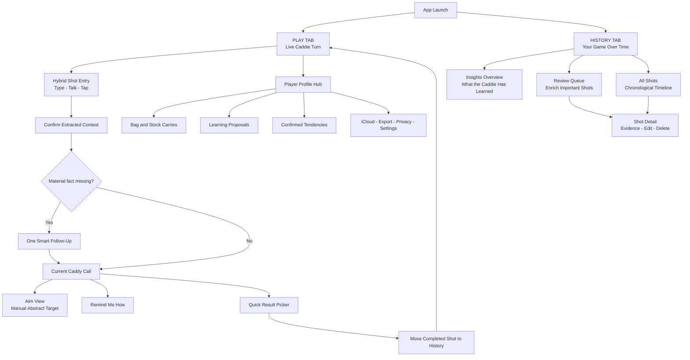
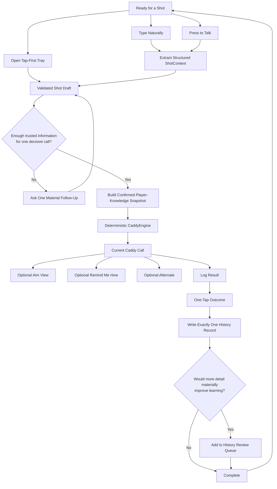
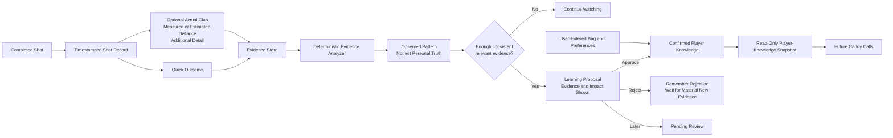
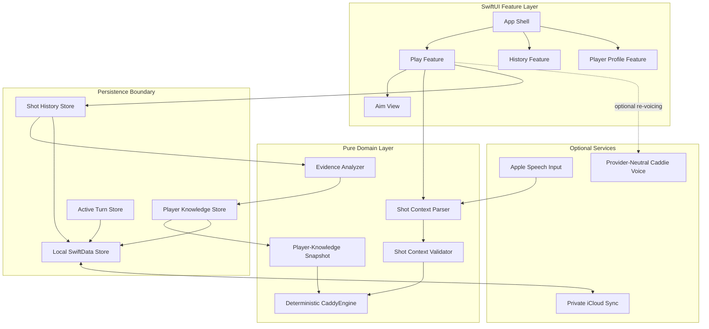

# Colt's Caddy North-Star Product and Architecture Design

**Status:** Approved; Phase 0 source-of-truth reconciliation authorized
**Date:** 2026-07-18
**Selected direction:** Focused Caddie Loop
**Repository:** `/Users/colton/Desktop/COLTSCADDY`

## 1. Purpose and authority

This document defines the approved north-star product, screen map, learning
model, and technical direction for Colt's Caddy. It is a design contract, not
authorization for a large implementation pass.

After Colt approves this written version:

1. `Docs/PROJECT.md` becomes the canonical product and experience source of
   truth.
2. `Docs/ROADMAP.md` remains the only authority for the next implementation
   action.
3. `Docs/ARCHITECTURE.md` owns current technical rules and boundaries.
4. `Docs/CADDY_LOGIC.md` owns current deterministic recommendation behavior.
5. `Docs/DECISIONS.md` records dated decisions and proof receipts; the latest
   applicable decision wins.
6. `ARCHITECT_HANDOFF.md` remains a lower-authority orientation snapshot.

The external `SOURCE_OF_TRUTH_UPDATE.md` dated 2026-07-13 is useful historical
input, but it does not become another governing document. Its valid principles
are incorporated here; its obsolete implementation status and conflicting
requirements are not.

## 2. Product promise

Colt's Caddy is a personalized decision caddie that learns Colt's actual game
and gives one decisive recommendation for the shot in front of him.

> Do not only tell me what the shot plays like. Tell me what the shot plays
> like for me.

The product succeeds through a closed loop:

`Play -> Call -> Result -> History -> Confirmed Knowledge -> Better Call`

The opening moment belongs to **Get the Call**. The app launches directly into
Play without a dashboard, mode chooser, or Start Round gate.

## 3. Governing product decisions

### 3.1 Primary destinations

The app has two primary tabs:

- **Play:** one live caddie turn.
- **History:** insights, review, and the complete shot record.

There is no standalone Coach tab. Coaching appears contextually as execution
help in Play and evidence-backed improvement insight in History.

The golfer button opens a Player Profile hub containing trusted player data,
learning controls, sync, export, privacy, and settings. Player Profile is a
utility, not a third tab.

### 3.2 No round model

Colt's Caddy does not create, start, resume, or end rounds. Every shot receives
a timestamp.

- **Today's form** means evidence from the current calendar day.
- **Recent form** means a rolling evidence window.
- **Long-term form** means the confirmed historical baseline.

History groups shots by calendar date, not by round or hole.

### 3.3 One live turn, not an accumulating chat

Play preserves the caddie's conversational personality for the current shot,
but completed cards do not accumulate into a lifetime thread. A live turn may
contain:

1. Colt's shot description.
2. One material follow-up when necessary.
3. One structured Caddy Call.
4. Optional Aim View, Alternate, and Remind Me How disclosures.
5. One quick result.

Logging completes the live turn, moves the shot into History, and resets Play.
An unfinished turn survives tab switching and app interruption.

### 3.4 Hybrid shot entry

The north star supports three equivalent entry routes:

- Type a natural description.
- Press to talk.
- Open the tap-first structured tray.

Typed and spoken language may prefill structured fields, but they never bypass
validation or feed directly into the recommendation engine. The structured tray
remains the complete offline fallback.

### 3.5 Progressive player setup

Initial setup is intentionally minimal:

- Clubs in the bag.
- Stock full-swing carry distance for each club.

Short-game preferences, common misses, validated cues, and tendencies are
learned progressively through real use and explicit confirmation. Colt is not
required to complete a fitting-style questionnaire before using the app.

### 3.6 Starter heuristics versus personal knowledge

The existing safety ideas about tee trouble, low-loft short-game options, and
avoiding hero recoveries may survive as conservative starter heuristics. They
are not automatically "Colt's three leaks."

Starter heuristics:

- Must be labeled internally as generic guardrails.
- Cannot masquerade as confirmed personal tendencies.
- Cannot override explicit player preferences or confirmed knowledge.
- Must trigger one focused question when missing personal information could
  materially change the call.

This rule prevents a generic 8-iron bump-and-run preference from being presented
as personalized advice.

### 3.7 Aim View boundary

Aim View survives as a child of the current Caddy Call. It is a manual,
abstract execution aid that may show:

- Intended line.
- Target area.
- Safe miss.
- Direction of user-marked danger.

Aim View may not use GPS, location, course imagery, green data, automatic target
detection, or a course database. Green Map is removed from the product.

### 3.8 Voice boundary

Press-to-talk belongs in the north star as a later implementation slice. It
uses the same structured extraction and confirmation path as typed language.
There is no always-listening mode or wake word.

### 3.9 Data ownership

The app remains local-first and works without an account. Private iCloud sync
is the north-star backup and multi-device model. There is no custom Colt's Caddy
account.

## 4. Selected approach and rejected alternatives

### 4.1 Selected: Focused Caddie Loop

The selected approach uses Play and History to make the learning loop visible
without turning the app into a dashboard.

It was selected because it:

- Preserves immediate access to the caddie.
- Makes History a first-class evidence surface.
- Supports personality without accumulating chat clutter.
- Keeps coaching contextual rather than building a generic practice product.
- Creates clean boundaries for deterministic decisions and confirmed learning.

### 4.2 Rejected: Expanded Chat

Extending the current lifetime thread would minimize early migration work but
would accumulate old cards, follow-ups, outcomes, and learning prompts. It
conflicts with the approved current-shot workspace.

### 4.3 Rejected: Golf Dashboard

A dashboard would expose more features at once but weaken the five-second Get
the Call opening moment and make Colt's Caddy feel like a generic golf utility
suite.

## 5. Canonical screen map

### 5.1 App shell behavior

- Play is the launch destination.
- Play and History each own a native `NavigationStack`.
- The bottom tab bar remains stable.
- Switching tabs preserves the unfinished turn and each tab's navigation.
- Aim View and Shot Detail are navigation destinations.
- Shot entry, outcome selection, and compact corrections use appropriately
  sized sheets.
- Starting another shot with an unlogged call requires explicit discard
  confirmation.

## 6. Play flow and decision boundary

### 6.1 Structured input contract

Every route produces a validated context with:

- Shot type.
- Lie.
- Trouble.
- Distance.
- Optional nuance.

Clear input proceeds immediately. Missing or ambiguous information is corrected
inline. One follow-up is allowed only when its answer could materially change
the recommendation.

### 6.2 Recommendation contract

The engine receives validated context plus an immutable, read-only snapshot of:

- User-entered bag and stock carries.
- Explicit player preferences.
- Confirmed tendencies.
- Validated execution cues.
- Starter heuristics clearly separated from personal knowledge.

The deterministic engine owns:

- Club and intended distance.
- Target.
- Safe miss.
- Alternate.
- Confidence.
- Engine-owned fallback language and execution cue.

Language processing may extract input or re-voice the completed structured
decision. It may not choose or alter golf strategy.

### 6.3 Current Caddy Call contract

The current command-first card retains:

- Club and intended distance.
- Target command.
- Safe miss.
- Why.
- One restrained alternate.
- Remind Me How.
- Manual Aim View entry.
- Log Result.

No old Caddy Calls accumulate underneath it.

### 6.4 Result contract

The on-course result remains the existing six-choice Quick Grid:

- Good.
- Left.
- Right.
- Short.
- Long.
- Poor contact.

Selection writes exactly one History record and disables duplicate logging.
Cancel or dismissal writes nothing. Additional evidence is requested later in
History rather than interrupting Play.

### 6.5 Play resilience

- Failed language extraction preserves the original sentence and opens the
  structured draft for correction.
- Failed speech returns to type/tap without losing the active turn.
- Missing bag information triggers a specific request instead of a fabricated
  club.
- Persistence failure leaves the result visible and retryable; the UI does not
  claim success.
- The complete structured recommendation path remains usable offline.

## 7. History and Player Knowledge

History opens with learned insight rather than a raw ledger.

### 7.1 Insights overview

Each prioritized insight shows:

- The observed pattern in plain language.
- Whether it is being watched, proposed, or confirmed.
- Relevant sample size and time window.
- Why it matters to future calls.
- A path to supporting shots.

History does not invent performance scores or fill empty space with generic
charts.

### 7.2 Review queue

Review contains only shots where added detail has meaningful learning value. It
may ask for:

- Actual club used.
- Measured or estimated distance, with provenance.
- Corrected shot context.
- Optional result detail.
- Whether a suggested execution cue was used.

Review is optional and never blocks the next call.

### 7.3 All Shots and Shot Detail

All Shots is chronological and grouped by calendar date. Shot Detail contains:

- Original shot context.
- Exact recommendation snapshot issued at the time.
- Logged outcome.
- Actual club and optional distance evidence.
- Additional notes.
- Insights or proposals using the shot as evidence.
- Edit and delete controls.

Editing or deleting evidence recalculates dependent observations and proposals.
The app cannot preserve a conclusion whose supporting evidence no longer
exists.

### 7.4 Evidence types

- **Fact:** Colt entered or directly confirmed it.
- **Result:** What happened on one shot.
- **Inference:** A pattern the analyzer suspects.
- **Confirmed tendency:** An inference Colt approved.
- **Cue:** An execution reminder Colt validated.
- **Confidence:** Strength and relevance of supporting evidence.

Short and Long outcomes are not measured distances. Only user-entered measured
or estimated distance evidence may support a carry-number proposal.

### 7.5 Confirmation gate

A carry or tendency proposal must show:

- Current value or belief.
- Proposed value or tendency.
- Number and recency of supporting shots.
- Evidence provenance.
- Expected effect on future recommendations.

Actions are **Approve**, **Keep Current**, and **Review Later**. Rejection is
remembered and the proposal cannot return without materially new evidence.

Only user-entered facts and approved proposals enter the snapshot that changes
future golf decisions. Unconfirmed observations may lower confidence or trigger
a relevant question, but they cannot silently choose a different club or
rewrite the profile.

## 8. Technical architecture

### 8.1 Layer boundaries

- SwiftUI features own presentation and transient UI state.
- Named stores own persistence writes.
- Domain services use immutable Swift value types.
- SwiftData models do not become the engine's working state.
- A mapper builds `PlayerKnowledgeSnapshot` from persisted confirmed knowledge.
- CaddyEngine imports no SwiftUI, CloudKit, speech, or provider SDK.

### 8.2 Domain services

**Shot Context Parser** converts typed or transcribed language into a structured
draft. It may use a local parser for ordinary phrases and an optional
provider-neutral backend for complex input. It never makes a golf decision.

**Shot Context Validator** checks required fields, ranges, conflicts, and missing
player data. It determines whether one material follow-up is necessary.

**CaddyEngine** produces a complete structured recommendation from validated
context and confirmed knowledge. It works offline and never mutates persistence.

**Evidence Analyzer** produces observations and proposals using explicit
sample-size, recency, relevance, and provenance rules. It cannot confirm its own
inference.

### 8.3 Local persistence

SwiftData remains the authoritative on-device store. North-star schema families
cover:

- Active turn and structured draft.
- Shot context and recommendation snapshot.
- Result and optional enriched evidence.
- Player profile and club distances.
- Observed patterns.
- Learning proposals.
- Confirmed tendencies.
- Validated cues.
- Sync and modification metadata.

Schema evolution must be additive and migration-driven. Existing profile and
history data cannot be discarded for implementation convenience.

### 8.4 Private iCloud sync

CloudKit is a later phase behind the local persistence boundary.

- Local writes complete immediately and synchronize later.
- The app remains usable while offline or signed out of iCloud.
- Records use stable identifiers and modification metadata.
- Conflicts cannot silently overwrite confirmed carries or tendencies.
- Conflicting confirmed knowledge remains visible until Colt resolves it.
- Intentional deletions synchronize without resurrecting evidence.

### 8.5 Optional network services

A provider-neutral backend may support complex input extraction and optional
personality re-voicing. It may not select a club, alter the structured decision,
write history, or write player knowledge. Provider credentials never ship in
the app.

Network requests send only the minimum context required for the selected
optional service. Full history is not transmitted by default.

### 8.6 Privacy

- No location permission.
- No GPS collection.
- No course database.
- No advertising profile.
- No advertising or product-analytics profile derived from shot history.
- Export and complete deletion controls live in Player Profile.

## 9. Screen and interaction contracts

| Screen | Purpose | Primary action | Must not become |
|---|---|---|---|
| Play - Ready | Begin a live turn immediately | Describe the shot | Dashboard or round launcher |
| Shot Draft | Verify structured context | Get the call | Long form or data inspector |
| Smart Follow-Up | Resolve one material unknown | Answer the question | Open-ended interrogation |
| Caddy Call | Deliver one recommendation | Log result | Stats dashboard or equal-option menu |
| Aim View | Clarify execution | Return to call | GPS or course map |
| Outcome Picker | Capture a fast result | Select outcome | Detailed post-shot survey |
| History - Insights | Show learned understanding | Inspect insight | Generic analytics dashboard |
| Review Queue | Enrich valuable evidence | Review one shot | Mandatory homework list |
| All Shots | Show complete chronology | Open shot detail | Scorecard or round history |
| Shot Detail | Inspect and correct evidence | Save correction | Recommendation editor |
| Player Profile | Control trusted knowledge | Open profile area | Social profile |
| Bag and Carries | Enter equipment facts | Save carry values | Club-shopping database |
| Learning Proposal | Confirm or reject change | Approve or keep current | Silent automation |
| Data and Privacy | Control data | Manage data | Custom account center |

### 9.1 Scorecard Daylight

The approved visual system is:

- Warm off-white paper background.
- Slightly deeper warm-neutral surfaces.
- Warm charcoal primary ink.
- Forest green brand and primary actions.
- Flag red reserved for small-dose Caddy Call labeling.
- Amber reserved for Alternate semantics.
- SF Rounded throughout.

Forest green is the ambient brand color, not confidence. Confidence is conveyed
through language and evidence. Text pairings must meet WCAG AA, and outdoor
daylight readability takes precedence over decorative subtlety.

There are no decorative gradients, neon effects, excessive glass, golf novelty
textures, or generic AI dashboard styling. A scorecard grid texture is allowed
only when extremely subtle and cleanly implemented.

### 9.2 Navigation and presentation

- Short tasks use sheets; deep destinations use navigation.
- Sheets never hide required actions below safe areas.
- Keyboard presentation never obscures the active field or primary action.
- The tab bar and unfinished turn remain stable across navigation.
- Aim View, Alternate, and Remind Me How use restrained disclosure.
- Log Result remains the strongest post-call action.

### 9.3 Empty states

- With no History, explain that logged shots build player knowledge and provide
  one route to Play.
- With insufficient evidence, state that the caddie is still learning and show
  recent shots without fake insight.
- With no review work, state that no shot currently needs detail.
- With no confirmed tendencies, explain the evidence and confirmation process.
- With unavailable iCloud, continue locally and label sync state honestly.

### 9.4 Accessibility

- Minimum 44-point targets.
- Semantic Dynamic Type.
- Accessibility-size stacking instead of clipping.
- Complete VoiceOver labels, values, states, and action results.
- Color never carries meaning alone.
- Reduce Motion removes nonessential movement.
- Increased Contrast remains readable.
- Logical reading and focus order.
- Aim View provides an equivalent textual plan.
- History visuals provide plain-language accessible summaries.
- Core workflows remain usable with Voice Control and Switch Control.

### 9.5 Motion

Motion communicates state rather than decorating the interface. Draft-to-call,
local disclosures, call completion, and proposal approval may animate briefly.
Motion is interruptible and Reduce Motion-aware. History does not use
celebratory animation or gamification.

### 9.6 Copy

- Full grammatical sentences and normal punctuation.
- Direct, concise, personal language.
- One recommendation, not equal choices.
- Honest uncertainty.
- No generic lesson before every shot.
- No wind, plays-like, GPS, score, map, or AI-marketing language.
- Starter heuristics are never described as personal tendencies before
  confirmation.

## 10. Delivery sequence

The north star is implemented one narrow, complete slice at a time.

### 10.1 Phase 0: reconcile the baseline

1. Finish or accurately close the current Phase 5 visual audit.
2. Make `Docs/PROJECT.md` the canonical product/experience authority.
3. Replace stale Range Finder references with Scorecard Daylight.
4. Remove Green Map and document the manual Aim View boundary.
5. Synchronize Architecture, Decisions, Roadmap, Caddy Logic, and Handoff.
6. Retain the July 13 source-of-truth update only as historical input.

### 10.2 Implementation slices

1. **Play and History app shell:** route the working flow into Play; add a
   truthful History empty state and chronology from existing records.
2. **Current-shot workspace:** replace accumulation with one restorable live
   turn while preserving the existing call and result behavior.
3. **Player Profile hub:** evolve the golfer button and preserve Bag editing;
   do not ship empty knowledge destinations.
4. **Shot Detail and enrichment:** add actual club, measured/estimated distance,
   correction, and deletion.
5. **Review queue:** identify only shots where detail materially helps.
6. **Evidence analyzer:** create observations without changing calls.
7. **Learning proposals:** add confirmation before knowledge affects calls.
8. **Typed natural-language entry:** parse into structured drafts with tap-first
   fallback.
9. **Smart follow-up:** ask one material question and reuse confirmed answers.
10. **Manual Aim View:** visualize the existing structured decision without
    location or course data.
11. **Press-to-talk:** feed transcript into the same structured pipeline.
12. **Private iCloud sync:** add CloudKit after local schema and edit semantics
    are stable.

No slice authorizes adjacent work. Each slice must preserve existing behavior
and proof before the next begins.

## 11. Verification contract

### 11.1 Every slice

**Source integrity**

- Clean-scope Git diff.
- No unrelated files changed.
- Product-contract changes update the correct documentation.
- Existing user data survives migrations.

**Build and automated testing**

- Generic iOS Simulator build.
- Focused unit tests for changed domain or store behavior.
- Full `COLTSCADDYTests`.
- Focused UI test for the changed journey.
- Migration tests for SwiftData schema changes.

**Runtime observation**

- Concrete iPhone Simulator.
- Small and large iPhone layouts.
- Keyboard and safe-area behavior.
- Dynamic Type and accessibility sizes.
- VoiceOver labels and focus order for changed screens.
- Reduce Motion behavior when motion changes.
- Screenshot comparison against Scorecard Daylight.

Build success, tests, simulator observation, physical-device observation,
commit, push, and remote visibility remain separate proof claims.

### 11.2 System-level contracts

The finished system must prove:

- Type, talk, and tap produce equivalent validated contexts.
- Language processing cannot alter a structured golf decision.
- Missing personal data causes a targeted question, not fabricated knowledge.
- Logging writes exactly one record; cancel and dismissal write nothing.
- Editing or deleting evidence recalculates dependent observations.
- Inference cannot enter confirmed knowledge without approval.
- Rejected proposals do not immediately return.
- Short and Long outcomes do not become fake distance measurements.
- Offline Play and History remain complete.
- Sync conflicts cannot silently overwrite confirmed knowledge.
- Aim View requests no location and depends on no course map.

## 12. Success criteria

The product succeeds when:

- Colt can begin describing a shot immediately after launch.
- The caddie makes one decisive call from validated context and confirmed
  knowledge.
- On-course logging remains one tap.
- History clearly distinguishes known, suspected, and uncertain information.
- Every personalized claim traces to user input or supporting evidence.
- Correcting the caddie makes future calls more personal.
- Network, speech, and sync failure never remove the core caddie.
- The app remains simpler and faster than a general golf dashboard.

## 13. Permanent non-goals

- Scorecards.
- Hole or round management.
- GPS, location, or course maps.
- Green Map.
- Wind, elevation, or plays-like calculations.
- Sensor-based automatic shot tracking.
- Always-listening voice.
- Custom accounts.
- Social feeds, leaderboards, badges, or gamification.
- Generic drill libraries or a standalone Coach tab.
- Unconfirmed automatic profile mutation.
- Three equal recommendation choices.
- An accumulating lifetime chat transcript.
- Course databases or automatic target detection.

External launch-monitor imports may be evaluated later, but the core learning
loop cannot depend on them.

## 14. Written-design review gate

This document must be reviewed and approved by Colt before an implementation
plan is written. After approval, the next planning step must begin with Phase 0
source-of-truth reconciliation and preserve the one-feature-per-loop contract.
